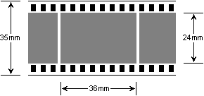

# Introducción

Una señal se puede definir como una secuencia de valores asociados a una magnitud, durante el procesamiento digital de señales se toman muestras de estos valores para generar un análisis de los mismos o para modificarlos, utilizando para ello un procesador implementado con sistemas digitales.

Algunos ejemplos de señales y aplicaciones de su procesamiento son los siguientes:

Ventajas del procesamiento digital de señales respecto al procesamiento analógico de señales:

{% embed data="{\"url\":\"https://codepen.io/chrisgannon/pen/GBxvRj\",\"type\":\"rich\",\"title\":\"Light Rider\",\"description\":\"Something pretty....\",\"icon\":{\"type\":\"icon\",\"url\":\"https://codepen.io/favicons/favicon-192x192.png\",\"width\":192,\"height\":192,\"aspectRatio\":1},\"thumbnail\":{\"type\":\"thumbnail\",\"url\":\"https://s3-us-west-2.amazonaws.com/i.cdpn.io/35984.GBxvRj.small.e67627f0-488d-4c54-b12a-775bdf371599.png\",\"width\":384,\"height\":225,\"aspectRatio\":0.5859375},\"embed\":{\"type\":\"app\",\"url\":\"https://codepen.io/chrisgannon/embed/preview/GBxvRj?height=300&slug-hash=GBxvRj&default-tabs=js,result&host=https://codepen.io&embed-version=2\",\"html\":\"<iframe src=\\\"https://codepen.io/chrisgannon/embed/preview/GBxvRj?height=300&amp;slug-hash=GBxvRj&amp;default-tabs=js,result&amp;host=https://codepen.io&amp;embed-version=2\\\" style=\\\"border: 0; width: 100%; height: 300px;\\\" allowfullscreen></iframe>\",\"height\":300,\"aspectRatio\":null}}" %}

[http://ocw.uv.es/ingenieria-y-arquitectura/1-1/tema1.pdf](http://ocw.uv.es/ingenieria-y-arquitectura/1-1/tema1.pdf)

